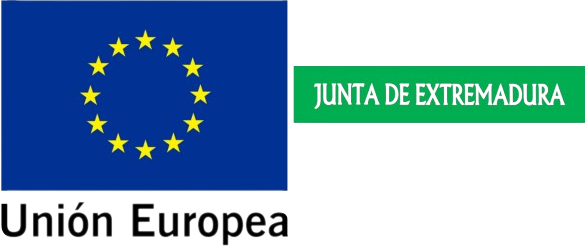

# TANNIRS

Boscalia Technologies S.L. en colaboración con la Junta de Extremadura (Consejería de Economía, Ciencia y Agenda Digital) y El Fondo Europeo de Desarrollo Regional (FEDER) desarrolla el proyecto TANNIRS.

## ¿Qué relación puede haber entre el vino, la madera y la espectroscopía?

Los **polifenole** son moléculas que abundan en la fruta y la madera y que están involucrados en varias fases de la crianza del vino. **La madera de las barrica** es una fuente importante de estos polifenoles. Durante el tiempo que el vino está en la barrica, se liberan estos compuestos desde la madera al vino modulando sus propiedades organolépticas (color, aroma y sabor). Una alternativa a las tradicionales barricas de madera es el uso de tanques de acero o aluminio combinados con alternativos de roble (ej.: astillas). Esto disminuye los tiempo de crianza y los costes derivados de las barricas de madera (cuidado, mermas por evaporación, etc), además de mejorar el control de los niveles de polifenoles que se liberan al caldo, ya que en exceso pueden ser contraproducentes. 

En los últimos años, la producción de alternativos de roble se ha sofisticado, pero solo se comercializa roble francés y americano. En España tenemos varias especies de roble con el mismo potencial. Su uso permitiría revalorizar el producto nacional y rentabilizar la gestión y cuidado de los bosques, potenciando la economía en el medio rural, fijando empleo y garantizando la sostenibilidad de los montes y su valor ambiental. Por otro lado, su uso introduciría nuevos matices y propiedades en el sector vinícola. 

Para dar este paso, es necesario aportar **garantías** de calidad. Aquí, es dónde la espectroscopía Vis-NIR puede ayudar a la caracterización química de las maderas garantizando unas propiedades enológicas aptas para la maduración de los vinos. Hasta ahora, las técnicas más utilizadas son costosas, lentas y destructivas. Mientras que la espectroscopía es una técnica barata, no destructiva y rápida. 

## DESARROLLO

Las muestras:
