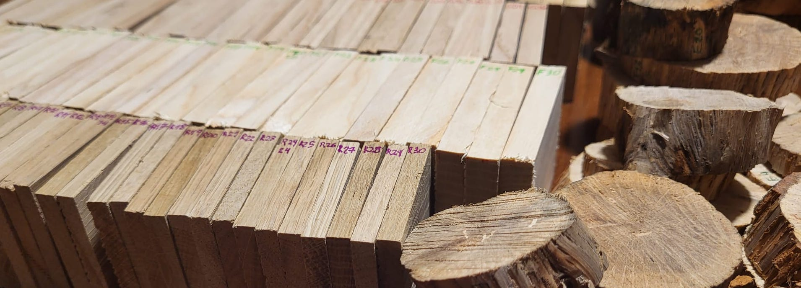
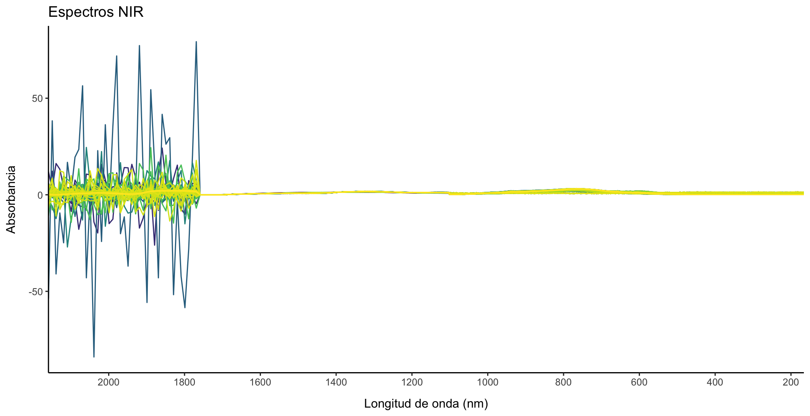

# TANNIRS

Proyecto desarrollado por Boscalia Technologies S.L. en colaboración con la Junta de Extremadura (Consejería de Economía, Ciencia y Agenda Digital) y El Fondo Europeo de Desarrollo Regional (FEDER).

## ¿Qué relación puede haber entre el vino, la madera y la espectroscopía?

Los <b>polifenoles</b> son moléculas que abundan en la fruta y la madera y que están involucrados en varias fases de la crianza del vino. <b>La madera de las barrica</b> es una fuente importante de estos polifenoles. Durante el tiempo que el vino está en la barrica, se liberan estos compuestos desde la madera al vino modulando sus propiedades organolépticas (color, aroma y sabor). Una alternativa a las tradicionales barricas de madera es el uso de tanques de acero o aluminio combinados con alternativos de roble (ej.: astillas). Esto disminuye los tiempo de crianza y los costes derivados de las barricas de madera (cuidado, mermas por evaporación, etc), además de mejorar el control de los niveles de polifenoles que se liberan al caldo, ya que en exceso pueden ser contraproducentes. 

En los últimos años, la producción de alternativos de roble se ha sofisticado, pero solo se comercializa roble francés y americano. En España tenemos varias especies de roble con el mismo potencial. Su uso permitiría revalorizar el producto nacional y rentabilizar la gestión y cuidado de los bosques, potenciando la economía en el medio rural, fijando empleo y garantizando la sostenibilidad de los montes y su valor ambiental. Por otro lado, su uso introduciría nuevos matices y propiedades en el sector vinícola. 

Para dar este paso, es necesario aportar <b>garantías</b> de calidad. Aquí, es dónde la espectroscopía Vis-NIR puede ayudar a la caracterización química de las maderas garantizando unas propiedades enológicas aptas para la maduración de los vinos. Hasta ahora, las técnicas más utilizadas son costosas, lentas y destructivas. Mientras que la espectroscopía es una técnica barata, no destructiva y rápida. 

## DESARROLLO

### Las muestras:

De entre los distintos tipos de alternativos de madera que se utilizan en la elaboración del vino, para más información consultar [Chatonet (2007)](https://www.infowine.com/intranet/libretti/libretto5484-01-1.pdf), se optó por aquellos en forma de cubos o dados. La especies que se analizaron fueron: castaño, cerezo, fresno, encina y roble francés. Las muestras de madera furon proporcionadas por propietarios forestales extremeños a excepción del proveedor comercial de las muestras de roble francés. En total se analizaron 30 muestras por especie (n = 150).

### Las técnicas analíticas:

**Cromatografía de Gases Masas (GC-MS)**

Esta técnica proporciona información sobre peso y estructura molecular. Es una técnica muy utilizada para conocer el contenido en elagitaninos en el vino, pero es costosa, lenta y destructiva. Antes de las mediciones en GC-MS hay que preparar las extracciones de los compuestos de la madera. Para eso se sumergen virutas de madera en una solución hidroalcohólica durante 15 días. Con esta técnica, llevada a cabo en la unidad SCSIE de la Universidad de Valencia, se obtuvieron datos del contenido en eugenol, β-methyloctalactona, guaiacol, 4-methyl guaiacol, vanillin, furfural, 5-methylfurfural. 

**Vis-NIR**

La espectroscopía Vis-NIR permite registrar la “huella dactilar” (físico-química) de la madera mediante el análisis de las vibraciones de los enlaces covalentes de la muestra en los rangos del espectro electromagnético visible (400-780 nm) e infrarrojo cercano (780-2500 nm). Las mediciones se realizarán con nuestro propio equipo, el espectrómetro portátil SATree-Boscalia, desarrollado por nuestra empresa y que cuenta con 3 detectores que cubren los siguientes rangos de longitudes de onda: 300-1.100 nm, 900-1.700 nm y 1.750-2150 nm.

**FTIR-ATR**

La espectroscopía FTIR-ATR, igual que Vis-NIR, permite registrar la “huella dactilar” (físico-química) de la madera, pero en otra longitud de onda, de forma que se complementan. Estas mediciones se llevaron a cabo en colaboración con el grupo CRETUS-EcoPast de la Universidade de Santiago de Compostela. 

**Procesado estadístico:**

Una vez obtenidos los datos de espectroscopía (NIR y MIR) y de GC-MS se procedió a su procesado y análisis estadístico. En el caso de los datos de NIR se realizaron 3 medidas por muestra y para combinar esta información con los datos de GC-MS y FTIR-ATR en las que solo se hizo una medida por muestra se calcularon los espectros promedios de NIR. Además, se consideraron los datos de NIR: (i) en su conjunto, (ii) entre 165 y 1100 nm, (iii) entre 1101 y 1700 nm y (iv) entre 165 y 1700 nm. En el caso de los datos de FTIR-ATR se identificaron los picos utilizando la librería {andurinha} de R siguiendo el protocolo descrito por [Álvarez Fernández and Martínez Cortizas (2020)](https://cran.r-project.org/web/packages/andurinha/index.html), utilizando la opción de la segunda derivada con los datos estandarizados y los picos se seleccionaron basándonos en los datos de espectroscopía FTIR-ATR proporcionados por la BBDD online [SpectraBase](https://spectrabase.com/); con una selección final de 79 picos. En el caso de los datos de GC-MS se detectan en todas las muestras alguno de los compuestos de interés, excepto en tres de ellas, en las que no se detecta ninguno, y, por tanto, se descartan para la creación de los modelos. 

Para los modelos de predicción de los compuestos de interés se utilizaron 9 conjuntos de datos combinando de formas distintas los datos obtenidos con espectrofotometría y los datos de GC-MS: (i) el conjunto total de datos de NIR, (ii) NIR de 165 a 1100, (iii) NIR de 1101 a 1700 nm, (iv) NIR de 165 a 1700 nm, (v) las cuatro variables anteriores con los 79 picos de FTIR-ATR y (vi) FTIR-ATR sin NIR. Los algoritmos que se probaron fueron: Regresión por Mínimos Cuadrados Parciales (PLS-R), Máquina de Vectores de Soporte Lineal (SVM-L) y Random Forest (RF). La división del conjunto de datos en datos de entrenamiento y de validación se hizo en una proporción 70/30. Los datos fueron previamente estandarizados y centrados y los modelos se entrenaron utilizando el paquete {caret} de R. El método estadísticos que dio mejores resultados fue Random Forest. En contra de lo esperado los modelos obtenidos con NIR no fueron muy buenos, obteniéndose un coeficiente de determinación (r2) < 0.6, este coeficiente representa la proporción de la varianza de la variable problema (o dependiente) que somos capaces de explicar con el modelo a través de las variables independientes. Sin embargo, se pudo obtener un modelo con buenos indicadores de predicción con los datos de FTIR-ATR. Las r2 fueron de 0.62 para el 5-methylfurfural, 0.73 para el eugenol, 0.87 para el furfural, 0.75 para el vanillin. Con una sensibilidad (probabilidad de que la especie clasificada como x sea realmente x) del 0.5 para el 5-methylfurfural y eugenol, de 0.78 para el furfural y de 0.67 para el vanillin. La especificidad (probabilidad de que la especie no clasificada como x no sea x) fue de un 0.75 para el 5-methylfurfural, 0.96 para el eugenol, 0.97 para el furfural y de un 0.83 para el vanillin. 
